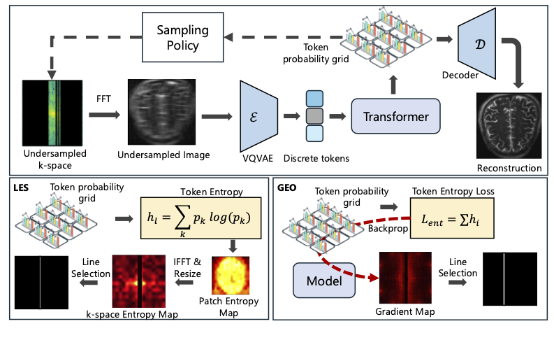

# Anatomical Token Uncertainty for Transformer-Guided Active MRI Acquisition

This is the official code repository for the paper:

> **Anatomical Token Uncertainty for Transformer-Guided Active MRI Acquisition**
> *Anonymous Authors*

## Overview

Full k-space acquisition in MRI is inherently slow. Compressed Sensing MRI (CS-MRI) accelerates acquisition by reconstructing images from under-sampled k-space data. A key challenge is designing the sampling trajectory adaptively per patient scan.

This work proposes **TRUST** (Token Reconstruction via Uncertainty-guided Sampling Transformers), a framework that leverages the discrete structure of a pretrained medical image tokenizer ([MedITok](https://arxiv.org/abs/2505.19225)) and a latent autoregressive Transformer to guide active k-space acquisition. The Transformer's predictive distribution over the token vocabulary provides a principled uncertainty measure via **token entropy**, which drives two complementary active sampling policies:

- **Latent Entropy Selection (LES)**: projects patch-wise token entropy into the k-space domain via IFFT to identify informative sampling lines.
- **Gradient-based Entropy Optimization (GEO)**: selects k-space measurements by computing the gradient of a total latent-entropy loss with respect to the sampling mask.

We evaluate on the **fastMRI single-coil Knee and Brain** datasets at ×8 and ×16 acceleration.



## Repository Structure

```
TRUST-MRI/
├── data/                   # k-space / MRI data utilities (FFT, masks)
├── models/                 # MedITok tokenizer (encoder + VQ + decoder)
├── utilities/              # Distributed training helpers
├── utils/                  # Logger, EMA, distributed init
├── dataset/                # MRI dataset loader (fastMRI HDF5 format)
├── autoregressive/
│   ├── models/
│   │   ├── gpt_kar.py      # Autoregressive Transformer (KAR-GPT)
│   │   ├── generate.py     # FAR reconstruction + active sampling logic
│   │   └── quant.py        # Quantization utilities
│   ├── sample/
│   │   ├── reconstruct_far.py   # Evaluation / reconstruction script
│   │   └── adaptive_sampling.py # LES and GEO uncertainty policies
│   ├── train/
│   │   └── train_far.py    # Distributed training script
│   └── utils/
│       ├── mask_utils.py   # Radial / Cartesian k-space mask utilities
│       └── metrics.py      # NMSE, SSIM, PSNR, LPIPS, DISTS, SSFD
└── requirements.txt
```

## Installation

```bash
conda create -n trust-mri python=3.11
conda activate trust-mri
pip install -r requirements.txt
```

## Pretrained Weights

Download the **MedITok** tokenizer checkpoint:

```bash
pip install huggingface_hub
python -c "from huggingface_hub import snapshot_download; snapshot_download('massaki75/meditok', local_dir='weights/meditok')"
```

This places the tokenizer weights and config at `weights/meditok/`.

## Data

The dataset loader expects [fastMRI](https://fastmri.org/) single-coil knee and brain data in HDF5 format (`.h5` files). Each file should contain the `kspace` key with complex-valued k-space data.

Optionally provide a `--data-split` `.txt` file listing filenames (one per line) to restrict evaluation to a specific subset.

## Training

Train the KAR-GPT Transformer on pre-tokenized MRI codes:

```bash
torchrun --nproc_per_node=NUM_GPUS autoregressive/train/train_far.py \
    --exp-name my_experiment \
    --data-root /path/to/fastmri/knee \
    --encoder-ckpt weights/meditok/meditok.pt \
    --encoder-config weights/meditok/config.json \
    --gpt-model GPT-L \
    --image-size 320 \
    --downsample-size 16 \
    --center-fractions 0.08 \
    --accelerations 4 \
    --far-mask-mode cartesian \
    --results-dir results/my_experiment
```

Key training arguments:

| Argument | Default | Description |
|---|---|---|
| `--gpt-model` | `GPT-L` | Model size (`GPT-B`, `GPT-L`, etc.) |
| `--image-size` | `256` | Input image resolution |
| `--center-fractions` | `0.04` | Fraction of center k-space lines always acquired |
| `--accelerations` | `8` | Undersampling acceleration factor |
| `--far-mask-mode` | `cartesian` | Mask type: `cartesian` or `radial` |
| `--p-empty` | `0.5` | Probability of training with empty additional mask |
| `--vocab-size` | `32768` | MedITok codebook size |
| `--num-codebooks` | `8` | Number of codebooks |

## Evaluation / Reconstruction

Run FAR reconstruction with optional active sampling:

```bash
python autoregressive/sample/reconstruct_far.py \
    --gpt-ckpt results/my_experiment/checkpoints/model.pt \
    --encoder-ckpt weights/meditok/meditok.pt \
    --encoder-config weights/meditok/config.json \
    --data-root /path/to/fastmri/knee \
    --image-size 320 \
    --center-fractions 0.04 \
    --accelerations 8 \
    --output-dir recon_output
```

To enable **LES** (Latent Entropy Selection) active sampling:

```bash
python autoregressive/sample/reconstruct_far.py \
    ... \
    --active-sampling \
    --active-sampling-budget 16 \
    --n-steps 4
```

Key evaluation arguments:

| Argument | Default | Description |
|---|---|---|
| `--active-sampling` | off | Enable active k-space line selection |
| `--active-sampling-budget` | `None` | Number of k-space lines to add per step |
| `--n-steps` | `None` | Number of active acquisition steps |
| `--center-fractions` | `0.04` | Initial center fraction |
| `--accelerations` | `4` | Initial acceleration factor |
| `--gt-mode` | — | Ground truth mode: `raw` or `autoencoded` |

## Metrics

Reconstruction quality is reported with:
- **NMSE** — Normalized Mean Squared Error
- **SSIM** — Structural Similarity Index
- **PSNR** — Peak Signal-to-Noise Ratio
- **LPIPS** — Learned Perceptual Image Patch Similarity
- **DISTS** — Deep Image Structure and Texture Similarity
- **SSFD** — Self-Supervised Feature Distance

## Acknowledgements

This work builds on:
- [MedITok](https://github.com/Masaaki-75/meditok) — the unified medical image tokenizer
- [LlamaGen](https://github.com/FoundationVision/LlamaGen) — autoregressive image generation
- [fastMRI](https://fastmri.org/) — the MRI reconstruction benchmark dataset

## Citation

If you use this code, please also cite the MedITok tokenizer:

```bibtex
@article{ma2025meditok,
  title={{MedITok}: A Unified Tokenizer for Medical Image Synthesis and Interpretation},
  author={Ma, Chenglong and Ji, Yuanfeng and Ye, Jin and Li, Zilong and Wang, Chenhui and Ning, Junzhi and Li, Wei and Liu, Lihao and Guo, Qiushan and Li, Tianbin and He, Junjun and Shan, Hongming},
  journal={arXiv preprint arXiv:2505.19225},
  year={2025}
}
```
